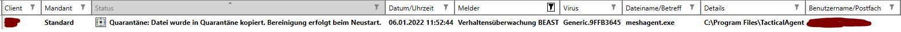
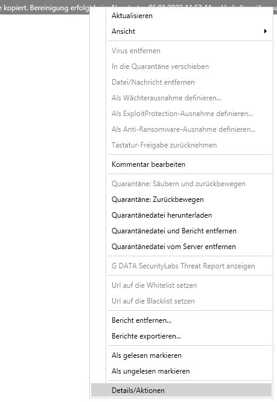
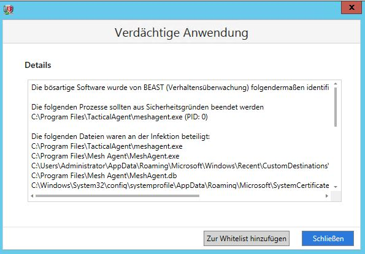
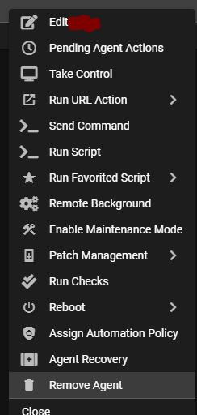

## Bitdefender Gravityzone

Admin URL: <https://cloud.gravityzone.bitdefender.com/>

To exclude URLs: Policies > {policy name} > Network Protection > Content Control > Settings > Exclusions

## Webroot

Admin URL:

## GData Business

The GData behaviour engine "BEAST" is recognizing tacticalrmm as malicious. It is not possible to exclude this prior to deploying.
Therefore BEAST must be triggered by tacticalrmm first to define a tenant-wide exclusion.

1. Deploy tacticalrmm client on one (non critical) machine in the tenants environment where the GData client is installed

2. The installation should be successful and the client will show up in the tactical dashboard, but will only report once, since meshagent.exe will be blocked by BEAST at this point

3. Check in the GData MMS Administrator security-logs for a BEAST entry für the machine you just installed the tactical client on

4. Right click the entry and choose "Details/Actions" (Or "Details/Aktionen" in german)

5. In the following window click on "Add to whitelist" (Or "Zur Whitelist hinzufuegen" in german) to whitelist the meshagent.exe for the whole tenant

Please note that although a whitelist addition in this dialouge adds the meshagent.exe for all the existing and future machines running under that particular tenant, it is NOT serverwide. If you have a multi-tenant environment (e.g. hosting GData MMS services for more than one customer, branch-offices or otherwise tenant divided entities) you need to do this for each individual tenant.

6. Now deinstall tacticalrmm and the meshagent from the machine. At this point a reboot MAY be required, because the meshagent.exe can still be locked by GData

7. Delete the machine from tacticalrmm

8. Reinstall tacticalrmm on the machine. Check if it propery shows up in the dashboard and taking control works.

9. Tacticalrmm can now be deployed in the tenants environment